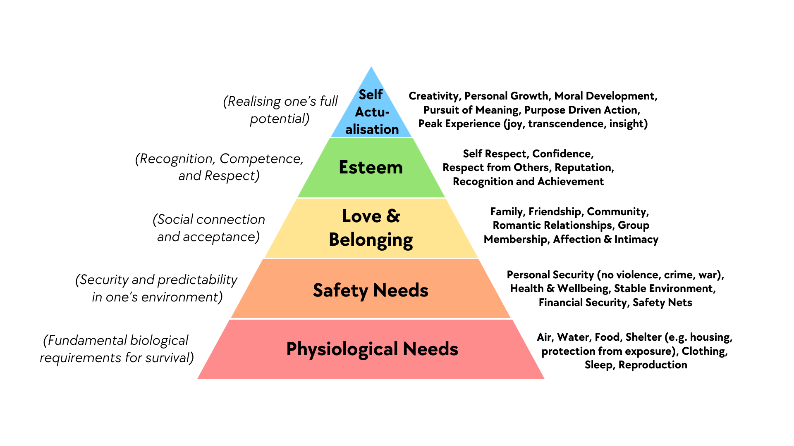
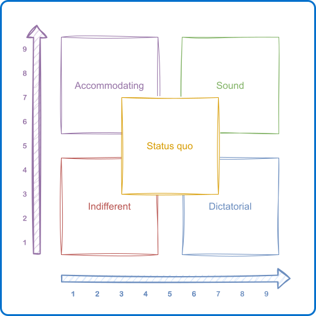
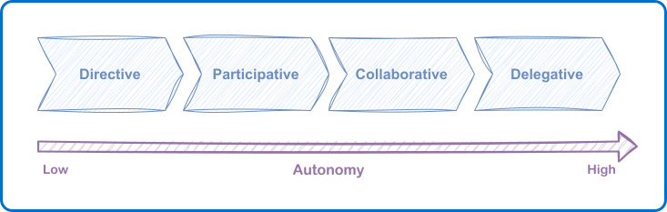

Is your manager a tyrant, a coach, or a ghost? Whether we realize it or not, we
have all experienced or exercised a management style inherited from a specific
era. Yet, these postures are often oversimplified as mere personality traits.
This is a mistake.

From the factories of 1900 to modern agile startups, every style has its own
logic and history. Understanding these origins means moving beyond simply
"enduring" management to actively choosing the one that fits your team today.
Let’s return to the roots to unlock your potential.

## The Classical School: The obsession with Efficiency

Management found its foundations at the end of the 19th century, in a context
of massive industrialization where the priorities were predictability and
large-scale efficiency. The "classical" approaches, led by Frederick Taylor,
Henri Fayol, and Max Weber, answered a clear need:
- Organize work,
- Reduce variability,
- Maximize production.

In this model, the manager is primarily a system conductor, the guardian of
processes, rules, and execution. Power is centralized, communication is strictly
top-down, and compliance is the main lever for performance. This model,
fundamental for structuring organizations, corresponds to what we now call
**command-and-control** management.

However, by the early 20th century, limits began to appear, limits that product
and agile organizations still know very well:
- Rigidity in the face of change,
- Low employee engagement,
- Difficulty fostering innovation.

## The 1930s Shift: When the human element entered the equation

In the 1930s, Elton Mayo and the Human Relations movement demonstrated that
motivation, a sense of belonging, and recognition have a direct impact on
performance. This realization is now central to modern teams, where engagement
and purpose are key drivers.

Meanwhile, Kurt Lewin’s work on group dynamics laid the groundwork for what
would later be called adaptive leadership. By identifying different forms of
leadership and their effects on behavior, Lewin paved the way for a situational
reading of management: the leader's role is no longer just to decide, but to
create the conditions for collective performance.

Kurt Lewin identified three main leadership styles:
- **Authoritarian** (or Autocratic): Characterized by centralized control. The
  leader makes all decisions and sets the rules. This can increase short-term
  productivity but stifles motivation, creativity, and engagement.
- **Democratic** (or Participative): Involves group members in decisions. It
  fosters dialogue and cooperation, strengthening motivation and innovation
  while maintaining stable productivity.
- **Laissez-faire** (or Permissive): Minimal leader intervention. It allows
  total autonomy. This works with highly experienced experts but risks
  disorganization and conflict if the group lacks structure.

> [!note] Did you know? The Legacy of Mary Parker Follett**
> Long before these ideas became standard, Mary Parker Follett proposed a
> radically modern vision. She advocated for co-construction—power exercised
> _with_ others rather than _over_ them.
>
> I am convinced her writings should be read by every manager. Her modernity
> is striking: although she lived during the classical era, she anticipated
> the conclusions of the Human Relations school and _servant leadership_ by
> decades.

This transition marked a decisive turning point: the manager gradually stopped
being a mere hierarchical relay and became a facilitator, a leader at the
service of the team. Agile practices are not a break from history; they are its
logical conclusion.

## The Era of Motivation: Psychology meets the factory floor

In the 1950s and 60s, management began systematically integrating the human
factor. Rensis Likert refined Lewin’s work by focusing on the relationship
between the manager and subordinates. He identified four systems:
- **Exploitative Authoritative** (hard, centralized authority),
- **Benevolent Authoritative** (paternalistic),
- **Consultative** (partial involvement),
- **Participative** (advanced democratic governance).

At the same time, Abraham Maslow proposed his famous hierarchy, ranking human
motivations (physiological, safety, belonging, esteem, self-actualization). His
contribution highlighted that sustainable performance depends as much on
satisfying these needs as it does on work organization.

These approaches paved the way for more participative and motivating practices
that would permanently influence modern management.

## Production vs. People: Finding the perfect balance

Building on Lewin and Likert, Blake and Mouton (1964) proposed an approach
centered not just on power, but on managerial priorities. Their grid rests on
two axes:
- Concern for **Production**,
- Concern for **People**.

By combining these dimensions, they identified five archetypal styles, ranging
from the **Impoverished (1,1)** style (low concern for both) to the
**Team Management (9,9)** style—the "Holy Grail" where performance and
engagement are simultaneously prioritized.

In agile and product-oriented organizations, this evolution is particularly
visible. The manager (or Tech Lead) acts as a system facilitator. Where
classical models asked "who decides?", contemporary practices focus on "how do
decisions emerge?".

## Emotional Intelligence: The key to modern leadership

In the late 1990s, Daniel Goleman marked a new milestone. Drawing on emotional
intelligence, he stopped looking for an "optimal" style and instead analyzed
how leadership influences the team climate based on context.

Goleman identified six styles (Coercive, Visionary, Affiliative, Democratic,
Pacesetting, Coaching). His major contribution? It’s not about adopting one
dominant style, but knowing how to **consciously switch** between styles
depending on the team’s maturity. This resonates directly with agility, where
leadership is inherently adaptive and distributed.

## A Pragmatic Approach: Matching Style to Autonomy

Theories are fascinating, but how do you apply them at 9:00 AM on a Tuesday?
For a framework to be useful, it must be actionable. That is why my reading of
situational management focuses on one simple data point: the **level of**
**autonomy** of a collaborator regarding a specific task.

1.  **Low Autonomy (Directive Style):** Necessary for a junior or a new task.
    The manager clarifies the *what* and the *how* to secure execution.
2.  **Developing Autonomy (Participative Style):** The manager discusses
    options and listens but still makes the final call. This is the key phase
    for skill development.
3.  **Intermediate Autonomy (Collaborative Style):** The decision is made by
    the collaborator. The manager supports and validates the framework but
    no longer decides.
4.  **High Autonomy (Delegating Style):** The manager focuses on the result and
    the deadline without interfering in the *how*.

This axis is continuous. The same collaborator might require directive
management on a new technology while being completely autonomous in their
core expertise.

## Conclusion

The history of management teaches us that there is no style that is inherently
superior to others. The myth of the "kind" manager who never gives orders is
just as dangerous as that of the omnipresent "micro-manager."

Effective management is not the one that matches your personal preferences, but
the one that accurately adapts to your team's situation. So, which style do you
use most often by reflex? Perhaps it is time to try the one that feels the
least natural to you.

> [!info] Some links for further reading
> - [The Situational Leadership® Model](https://situational.com/situational-leadership/)
> - [Management 3.0](https://management30.com)
> - Prophet of management by Mary Parker Follett ([livre](https://www.amazon.com/Mary-Parker-Follett-Prophet-Management/dp/1587982137))
> - Primal Leadership: Unleashing the Power of Emotional Intelligence by Daniel Goleman ([livre](https://www.amazon.com/Primal-Leadership-New-Preface-Authors/dp/1422168034))
