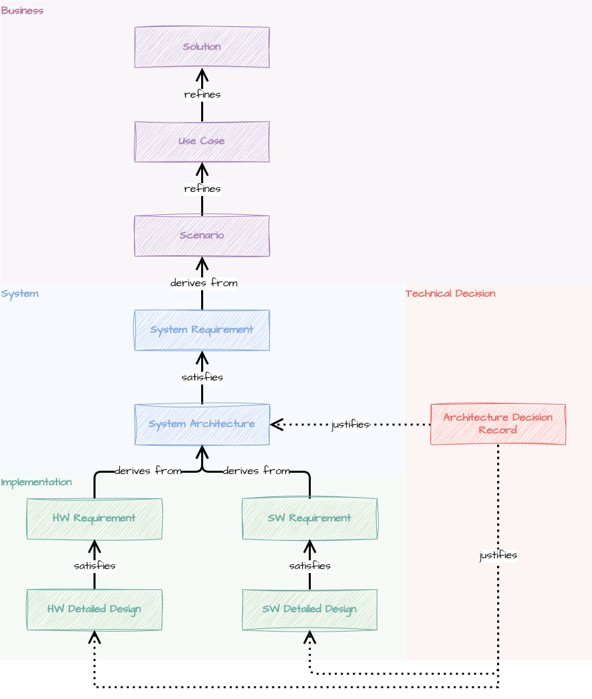


Tout au long de ma carrière dans les systèmes embarqués, j'ai vu des équipes se
débattre avec le même problème encore et encore: la traçabilité des exigences.


Vous connaissez la chanson: audits ASPICE, évaluations CMMI, conformité ISO
26262, etc. Tout le monde a besoin de traçabilité, et les options sont toujours
les mêmes : des outils d'entreprise coûteux comme DOORS qui semblent avoir été
conçus à une autre époque, ou des contournements basés sur JIRA qui s'intègrent
mal avec le code et ralentissent tout.

Je voulais quelque chose de différent. Quelque chose de gratuit, open-source et
performant. Quelque chose qui correspond à la façon dont les équipes modernes
travaillent réellement. Et surtout, quelque chose de prêt pour l'IA, car la
façon dont nous écrivons et consommons les spécifications est sur le point de
changer radicalement.

J'ai donc créé **SARA**.



## Qu'est-ce que SARA ?

SARA signifie _**S**olution **A**rchitecture **R**equirements for 
**A**lignment_. C'est un outil en ligne de commande qui gère vos documents de
solution, d'architecture et vos exigences sous forme de graphe de connaissances
interconnecté, fournissant une source unique de vérité pour toutes les équipes,
du marketing et du business jusqu'à l'ingénierie.

Mais ce qui distingue SARA, ce ne sont pas les fonctionnalités, c'est la
philosophie qui les sous-tend.

## Markdown-first: Un choix radical

SARA utilise des fichiers Markdown avec un en-tête YAML. Pas de formats
propriétaires. Pas de bases de données. Pas d'abonnements.

Cela peut sembler être une limitation sur certains aspects, mais c'est en
réalité le choix le plus puissant que je pouvais faire:
- **Aucun verrouillage fournisseur.** Vos exigences vivent dans des fichiers
  texte que vous possédez pour toujours. Si SARA disparaît demain, vos données
  restent parfaitement lisibles.
- **Workflows natifs Git.** Versionnement, branches, merge, revues de code.
  Vos exigences suivent le même cycle de vie que votre code. Rédigez dans une
  branche, révisez dans une pull request, livrez avec un tag.
- **Lisibilité universelle.** N'importe qui peut lire et modifier les documents
  sans logiciel spécial. U nouveau membre dans l'équipe ? Il sait déjà comment
  l'utiliser.
- **Prêt pour l'IA dès la conception.** C'est la partie qui m'enthousiasme le
  plus. Les formats texte sont idéaux pour les agents IA et les LLMs. Vos
  exigences peuvent être analysées et utilisées comme contexte pour le
  développement. L'IA peut aider à générer de nouvelles exigences. L'IA peut
  vérifier la cohérence. Les possibilités ne font que commencer à se dévoiler.
- **Principe DRY.** Votre documentation existante comme les diagrammes
  d'architecture, les présentations de solutions ou les pages produit, devient
  partie intégrante de votre graphe de connaissances sans duplication. Écrivez
  une fois, tracez partout.

## La hiérarchie de traçabilité

SARA reconnaît dix types de documents formant une hiérarchie d'exigences, des
solutions de haut niveau jusqu'aux conceptions détaillées :

Les neuf premiers types forment une chaîne verticale où chaque niveau affine
celui du dessus. Le dixième, le
[Architecture Decision Record (ADR)](/fr/posts/architecture-decision-record),
traverse la hiérarchie : il capture les décisions techniques significatives, le
raisonnement qui les sous-tend, et les liens vers les artefacts qu'elles
justifient.

Chaque élément peut retracer sa lignée jusqu'aux besoins métier et en avant
vers l'implémentation. C'est la traçabilité dont rêvent les auditeurs, et elle
émerge naturellement de la façon dont vous structurez vos documents.

## Pourquoi c'est important maintenant

Nous sommes à un point d'inflexion dans la façon dont les logiciels sont
construits. Les assistants IA deviennent de véritables collaborateurs, pas
simplement de l'autocomplétion sous stéroïdes. Mais ils ont besoin de contexte
pour être utiles.

Quand vos exigences vivent dans des fichiers Markdown avec des liens de
traçabilité explicites, un agent IA peut comprendre la vue d'ensemble. Il peut
lire votre vision de la solution, comprendre vos contraintes, descendre pour
voir comment les choses sont actuellement implémentées et faire des suggestions
qui correspondent réellement à votre architecture.

Quand vos exigences vivent dans DOORS ou dans un JIRA chaotique, bonne chance
pour intégrer ce contexte dans la compréhension d'une IA, ou alors vous êtes
contraint d'utiliser l'assistant IA et le modèle choisi par le fournisseur.

J'ai conçu SARA avec cet avenir en tête. L'approche Markdown-first ne vise pas
seulement à éviter le verrouillage fournisseur (même si c'est important). Il
s'agit de construire une fondation qui prendra de plus en plus de valeur à
mesure que les capacités de l'IA s'étendront.

## Et ensuite

SARA est jeune, mais les fondations sont solides. Je l'utilise sur de vrais
projets, et j'aimerais beaucoup que vous l'essayiez aussi. Ouvrez des issues,
soumettez des PRs, ou dites-moi simplement ce que vous en pensez.

Si vous voulez voir SARA en action, consultez le
[guide de démarrage](/fr/posts/sara-getting-started) où nous construisons une
chaîne de traçabilité complète pour un système de contrôle de maison
intelligente, de la vision de la solution jusqu'aux conceptions détaillées,
en utilisant le CLI.

L'objectif n'est pas de remplacer les outils d'entreprise pour tout le monde.
Certaines organisations en ont véritablement besoin. Mais pour les équipes qui
veulent quelque chose de plus léger, plus rapide et pérenne, SARA offre un
chemin différent.

Vos exigences sont trop importantes pour être piégées dans un système
propriétaire. Libérons-les.
